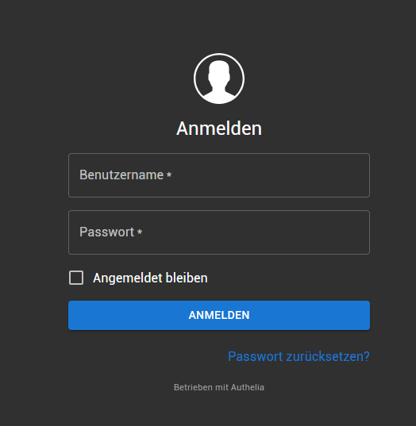
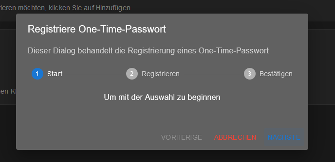
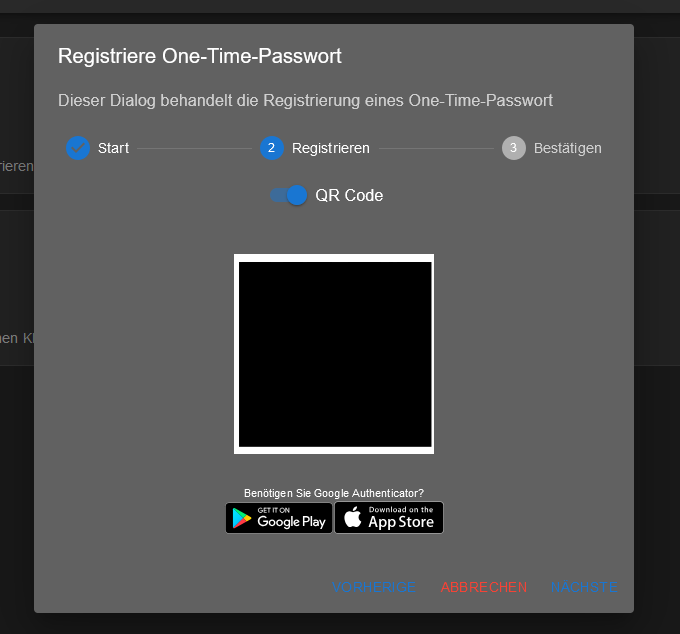
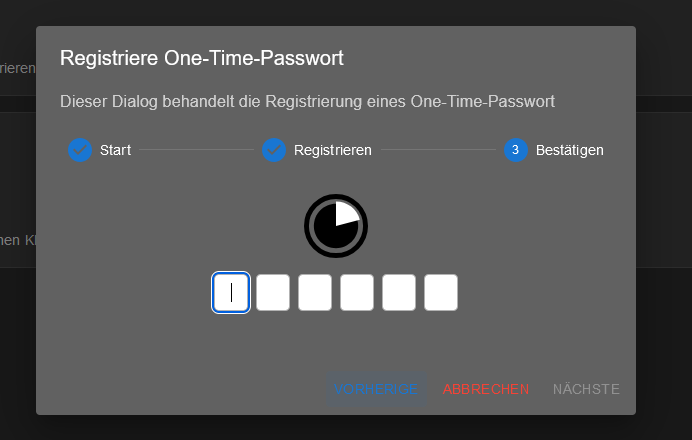

# Intro

Authelia ist ein leistungsstarker Open-Source-Server für Autorisierung und Authentifizierung. Mit Authelia könnt ihr eure Webseiten und Dienste mühelos zusätzlich absichern – besonders nützlich, wenn ein Dienst von Haus aus keine eigene Authentifizierung bietet.

Authelia ist die perfekte Ergänzung, um die Sicherheit auf das nächste Level zu heben.

---

## 1. Grundvoraussetzung

- Docker & Docker Compose v2 ( [Hier](/blog/server-setup#3-docker-und-docker-compose) )
- [Traefik Setup](/blog/traefik)

---


## 2. Ornder Struktur anlegen

```shell
mkdir -p /opt/containers/authelia/config
```

### 2.1 Compose Datei anlegen

```shell
nano /opt/containers/authelia/docker-compose.yaml
```

```yaml title="docker-compose.yaml"
services:
  authelia:
    image: authelia/authelia
    container_name: authelia
    volumes:
      - ./config:/config
    networks:
      - frontend
    labels:
      - "traefik.enable=true"
      - "traefik.http.routers.authelia.entrypoints=websecure"
      - "traefik.http.routers.authelia.rule=Host(`authelia.deine.domain.de`)"
      - "traefik.http.routers.authelia.tls=true"
      - "traefik.http.routers.authelia.tls.certresolver=cloudflare"
      - "traefik.http.routers.authelia.service=authelia"
      - "traefik.http.services.authelia.loadbalancer.server.port=9091"
      - "traefik.docker.network=frontend"
      - "traefik.http.routers.authelia.middlewares=middlewares-authelia@file"
    restart: unless-stopped
    healthcheck:
      disable: true
    environment:
      - TZ= Europe/Berlin

networks:
  frontend:
    external: true
```

> Hier deine Domain eintragen ->  "traefik.http.routers.authelia.rule=Host(`authelia.deine.domain.de`)"

### 2.2 Config Datei anlegen

```shell
nano /opt/containers/authelia/config/configuration.yaml
```

```shell title="configuration.yaml"
---
###############################################################
#                   Authelia configuration                    #
###############################################################

jwt_secret: !!!-secret1-HIER-!!!
default_redirection_url: https://authelia.deine.domain.de
theme: dark
server:
  host: 0.0.0.0
  port: 9091

log:
  level: debug

totp:
  issuer: authelia
  period: 30
  skew: 1

authentication_backend:
  file:
    path: /config/users_database.yaml
    password:
      algorithm: argon2id
      iterations: 1
      salt_length: 16
      parallelism: 8
      memory: 128

access_control:
  default_policy: deny
  rules:
    - domain:
        - "authelia.deine.domain.de"
      policy: bypass
    - domain: traefik.deine.domain.de
      policy: one_factor
    - domain: app.deine.domain.de
      policy: two_factor

session:
  name: authelia_session
  expiration: 3600  # 1 Stunde
  inactivity: 300  # 5 Minuten
  domain: deine.domain.de # Basedomain zb homelab.com


regulation:
  max_retries: 3
  find_time: 120
  ban_time: 300

storage:
  local:
    path: /config/db.sqlite3
  encryption_key: !!!-secret2-HIER-!!!
notifier:
  smtp:
    username: info@domain.de
    password: deinpasswort
    host: smtp.server.de
    port: 587
    sender: info@domain.de
```

Hier müssen wir einige Dinge anpassen. Zu erst erzeugen wir uns erstmal 2 sichere Schnlüssel mit:

```shell title="Erzeugt zwei Passwörter"
openssl rand -base64 64 # secret1
openssl rand -base64 64 # secret2
```

Diese Kopiert ihr in die Platzhalter ` **!!!-secret1-HIER-!!!** **!!!-secret2-HIER-!!!** `
```yaml title="folgendes anpassen"
jwt_secret: !!!-secret1-HIER-!!!
default_redirection_url: https://authelia.deine.domain.de
[...]
  rules:
    - domain:
        - "authelia.deine.domain.de" # <- Hier die Domain wie oben
      policy: bypass
[...]
  domain: deine.domain.de # Basedomain zb homelab.com
[...]
  encryption_key: !!!-secret2-HIER-!!!
notifier:
  smtp: ### <-- SMTP Server hinterlegen ist Pflicht, sonst geht es nicht.
    username: info@domain.de
    password: deinpasswort
    host: smtp.server.de
    port: 587
    sender: info@domain.de
```

### 2.3 Traefik anpassen

Nun müssen wir noch einige Einstellungen in Traefik anpassen. Diese Schritte könnt ihr nur 1:1 umsetzen, wenn ihr der [Traefik-Anleitung](/blog/traefik) genau gefolgt seid.

Öffnet nun die folgende Datei:

```shell
nano /opt/containers/traefik/config/conf.d/middlewares-authelia.yaml
```

```yaml title="middlewares-authelia.yaml"
http:
  middlewares:
    middlewares-authelia:
      forwardAuth:
        address: "http://authelia:9091/api/verify?rd=https://authelia.deine.domain.de" # <--- Hier muss deine Domain angepasst werden
        trustForwardHeader: true
        authResponseHeaders:
          - "Remote-User"
          - "Remote-Groups"
```

---

## 3. Traefik neustarten 

```shell
docker compose -f /opt/containers/traefik/docker-compose.yaml up -d --force-recreate
```

---

## 4. Benutzer anlegen

```shell
docker run authelia/authelia:latest authelia crypto hash generate argon2 --password sicheresPASswort
``` 
Die Ausgabe könnte so aussehen:

```bash
Digest: $argon2id$v=19$m=65536,t=3,p=4$SHXT9NCkWFhLCpWXaby7Ug$kubb68nAecPALUCeb3Xv8eoUox7KEIZimRVp4Rgt70M
```

$argon2id... usw ist der Passwort-Hash, den brauchen wir gleich.

```shell
nano /opt/containers/authelia/config/users_database.yaml
```

```yaml title="user_database.yaml"
---
###############################################################
#                         Users Database                      #
###############################################################
# List of users
users:
  benutzername: # <--- Hier müssen die selben Namen stehen
    displayname: "benutzername" # <--- Hier müssen die selben Namen stehen
    password: Passworthash hier hin
    email: authelia@euredomain.de
    groups:
      - admins
```

---

## 5. Authelia starten

```shell
docker compose -f /opt/containers/authelia/docker-compose.yaml up -d
```

Ruft jetzt die Domain eurer Authelia-Instanz auf ->  https://authelia.deine.domain.de

Dort sollte nun ein Login-Bildschirm erscheinen:



Melde dich mit deinem Benutzernamen und Passwort an.

Anschließend müsst ihr einen zweiten Faktor einrichten:


Ihr habt zwei Optionen:

**1. Klassisches One-Time-Password (OTP):**

* Hierbei erhaltet ihr eine E-Mail, um das OTP initial einzurichten







**2. WebAuthn:**

Diese Option ermöglicht euch die Nutzung moderner Authentifizierungsmethoden wie:
    
    * TPM-Chips
    * Yubikeys
    * Passkeys, z. B. aus Bitwarden oder Vaultwarden.


---

## 6. Dienste mit Authelia absichern

Hier ist eine überarbeitete Version deines Textes:

Jetzt läuft Authelia, und wir können damit Dienste absichern. Dafür sind Änderungen sowohl in der Docker-Compose-Datei des jeweiligen Projekts als auch in der Authelia-Konfiguration erforderlich.

**1. Anpassungen in der Authelia-Konfiguration**


In der Authelia-Konfigurationsdatei hinterlegen wir die Domain des Dienstes und definieren, ob der Dienst mit einem Faktor (nur Passwort) oder mit einem zweiten Faktor (OTP oder Passkey) abgesichert werden soll.

**2. Änderungen in der Docker-Compose-Datei**

In der Docker-Compose-Datei des jeweiligen Projekts müssen wir unter den Traefik-Labels die Middleware für Authelia hinzufügen.

### 6.1 Authelia Config anpassen

```shell
nano /opt/containers/authelia/config/configuration.yaml
```

```yaml title="configuration.yaml"
[...]
access_control:
  default_policy: deny
  rules:
    - domain:
        - "authelia.deine.domain.de"
      policy: bypass
    - domain: traefik.deine.domain.de <--- Hier kannst du deine Domains anpassen
      policy: one_factor <-- Ein Faktor oder zwei oder bypass
    - domain: app.deine.domain.de
      policy: two_factor
[...]
```

Tragt hier die entsprechenden Domains ein und startet Authelia anschließend neu.

```shell
docker compose -f /opt/containers/authelia/docker-compose.yaml up -d --force-recreate
```

---

### 6.2 Traefik Labels anpassen

Ich nehme als Beispiel Traefik, da es bereits installiert ist und das Dashboard keinen Zugriffsschutz bietet.

Öffnen wir also die Datei `docker-compse.yaml`.

```shell
nano /opt/containers/traefik/docker-compose.yaml
```

```yaml title="docker-compse.yaml"
---
services:
  traefik:
    image: docker.io/library/traefik:v3.2.3
    container_name: traefik
    ports:
      - 80:80
      - 443:443
      # --> (Optional) aktiviere dashboard, don't do in production
      - 8080:8080
      # <--
    volumes:
      - /run/docker.sock:/run/docker.sock:ro
      - ./config/traefik.yaml:/etc/traefik/traefik.yaml:ro
      - ./data/certs/:/var/traefik/certs/:rw
      - ./config/conf.d/:/etc/traefik/conf.d/:ro
    environment:
      - CF_DNS_API_TOKEN=${CF_DNS_API_TOKEN}
### In der Datei fügen wir die notwendigen Labels hinzu, um das Dashboard sowohl über SSL bereitzustellen als auch mit der Authelia-Middleware zu schützen.
    labels:
      - "traefik.enable=true"
      - "traefik.http.routers.traefik.entrypoints=websecure"
      - "traefik.http.routers.traefik.rule=Host(`traefik.meine.domain.de`)"
      - "traefik.http.routers.traefik.tls=true"
      - "traefik.http.routers.traefik.tls.certresolver=cloudflare"
      - "traefik.http.routers.traefik.service=traefik"
      - "traefik.http.services.traefik.loadbalancer.server.port=8080"
      - "traefik.http.routers.traefik.middlewares=middlewares-authelia@file" # <--- Middleware-authelia
      - "traefik.docker.network=frontend"
    networks:
      - frontend
    restart: unless-stopped
networks:
  frontend:
    external: true 
```

## 6.3 Traefik neustarten 

```shell
docker compose -f /opt/containers/traefik/docker-compose.yaml up -d --force-recreate
```

Nach diesen Änderungen sollte das Traefik-Dashboard nun durch Authelia gesichert sein.

So lassen sich Dienste mit einer zusätzlichen Schicht absichern.

Man kann auch nur bestimmte bereiche absichern. zb wenn man nur den pfad /admin mit authelia absichern möchte, kein problem.

Werde ich bestimmt bald was zu schreiben.

Bei fragen erreicht ihr mich über matrix oder mail oder mastodon.