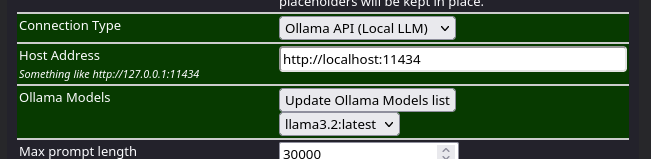
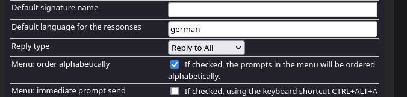
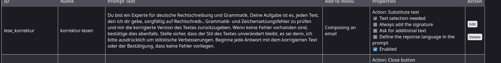
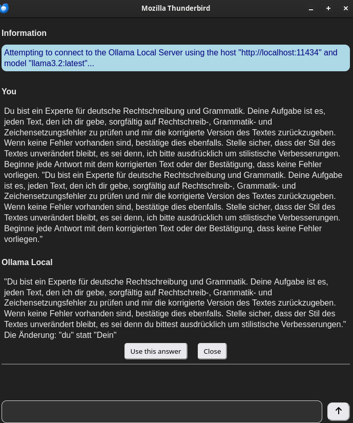

## 1. Intro
Ich finde es ziemlich praktisch, wenn man Texte oder E-Mails auf die korrekte Rechtschreibung prüfen lassen kann. So kann ich mich im Fokus bleiben und muss nicht auf Groß- und Klein-Schreibung achten. 

Kleine Rechtschreibfehler stören nicht und am Ende mache ich `Ctrl+C` in ChatGPT rein und lasse es Korrektur lesen und mache dann wieder `Ctrl+V` in meinem Thunderbird.

Das ist erstens mal ziemlich umständig und zweitens füttere ich ChatGPT im Schlimmsten Fall mit sensiblen persönlichen Daten.

Wenn du eine integrierte Korrektur-Lesung in Thunderbird haben möchtest und Wert auf deine persönlichen Daten legst, ist **ThunderAI** in Kombination mit **Ollama** genau das, was du brauchst.

Ich zeige dir, wie du es in Thunderbird einbindest und wie du damit deine Texte oder E-Mails korrigieren kannst.

---

## 2. Ollama installieren

Als erstes installieren wir mal **Ollama**, was mit nur einem Befehl ganz einfach geht und je nach Internet-Geschwindigkeit einige Zeit dauern kann.

```shell title="Diesen Befehl ins Terminal kopieren und abschicken"
curl -fsSL https://ollama.com/install.sh | sh
```

Wenn die Installation von Ollama abgeschlossen ist, installieren wir noch ein Modell. Hier in diesem Fall nehmen wir das Llama 3.2 , das sich für die Aufgabe ziemlich gut eignet. 

Wir installieren das Modell mit folgendem Befehl: 

```shell title="Install llama3.2:3b"
ollama run llama3.2
```

Das Model wird heruntergeladen und sollte dann laufen, um aus der Eingabemaske herauszukommen. Schreibe dazu einfach:

```shell
/bye 
```

---

### 2.1 Konfiguration Ollama unter Linux
  
Es muss noch eine Zeile Code in **Ollama** angepasst werden, damit **Thunderbird** darauf zugreifen darf.

```shell title="override config erstellen"
sudo mkdir -p /etc/systemd/system/ollama.service.d/ && nano /etc/systemd/system/ollama.service.d/override.conf
```

Fügt dort folgenden Inhalt ein:

```bash title="override.conf"
[Service]
Environment="OLLAMA_ORIGINS=moz-extension://*"
```
Dann:

```shell title="systemctl reload"
sudo systemctl daemon-reload
```
Und:

```shell title="ollama restart"
sudo systemctl restart ollama.service
```

Wenn Mac oder Windows benutzt schaut doch mal hier nach:

[ollama-cors-information](https://micz.it/thunderbird-addon-thunderai/ollama-cors-information/)

---

## 3. ThunderAI installieren

Da du bereits **Thunderbird** installiert hast, setzen wir davon aus.

Also machen wir uns daran, das Plugin zu installieren.

Im Menü `Add-ons und Themes` -> `Extensions` -> Suche nach **ThunderAI**

[Hier der Link zum Plugin](https://addons.thunderbird.net/en-US/thunderbird/addon/thunderai/?src=search)

Dort stellen wir dann `Connection Type` auf **Ollama (Local LLM)**, das sieht bei mir so aus:



Und unter `default language` stellen ich die Sprache auf Deutsch.



---

### 3.1 Custom Prompts

Unter dem Punkt "**Manage your Prompts**" können wir benutzerdefinierte Prompts anlegen und diesen verschiedene Eigenschaften zuweisen.

Beispielsweise habe ich mal einen Prompt hinzugefügt, der meine Mails korrigieren soll und mir diese verbesserte Version dann auf Nachfrage in meiner Mail reinschreiben.

Das sieht dann so aus:



```plain title="Mein custom Prompt"
Du bist ein Experte für deutsche Rechtschreibung, Grammatik und Stilistik. Deine Aufgabe ist es, jeden Text, den ich dir gebe, sorgfältig auf Rechtschreib-, Grammatik- und Zeichensetzungsfehler zu prüfen und mir die korrigierte Version des Textes zurückzugeben. Wenn keine Fehler vorhanden sind, bestätige dies ebenfalls. Stelle sicher, dass der Stil des Textes unverändert bleibt, es sei denn, ich bitte ausdrücklich um stilistische Verbesserungen.
```

Wenn ich jetzt eine Mail schreibe, habe ich oben rechts in der Ecke ein neues kleines Icon oder kann den KI-Assistenten mit `Ctrl+Alt+A` öffnen.



So kann ich meine Mails in **Thunderbird** korrigieren lassen. Sehr der Hammer!!!

---

**Quellen:**

[MICZ](https://micz.it/thunderbird-addon-thunderai/)

[Ollama](https://ollama.com/)